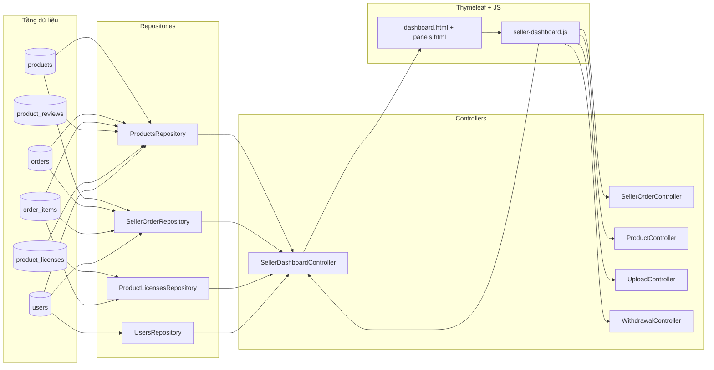
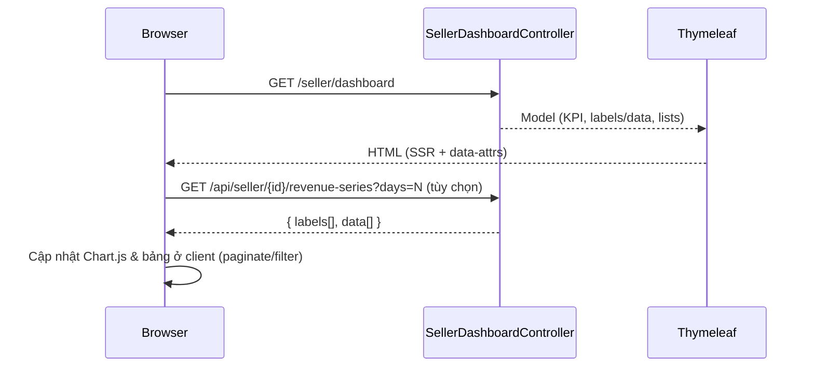
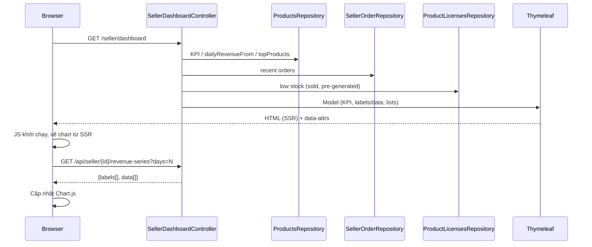
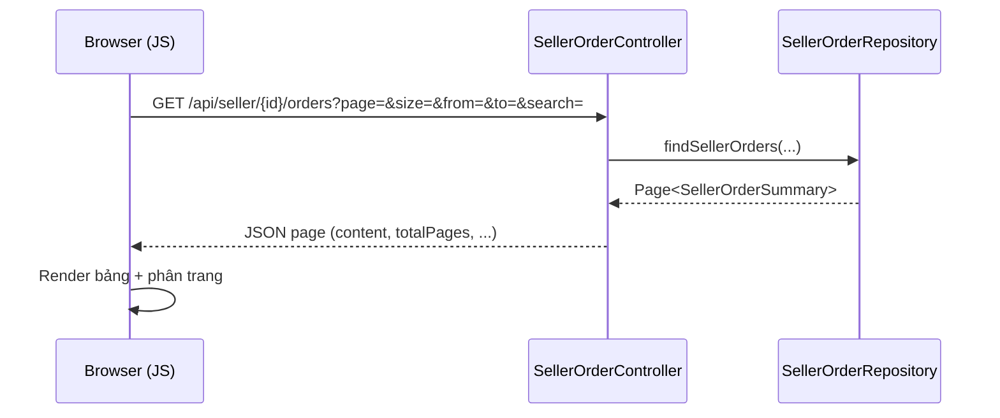

# Seller Dashboard – Luồng dữ liệu (bản ngắn gọn & chính xác)

Tài liệu này tóm tắt đường đi của dữ liệu cho trang Seller Dashboard: DB → Repository → Controller → Thymeleaf (SSR) → JavaScript (client) → UI. Mục tiêu: ai đọc cũng hình dung nhanh “dữ liệu nào đến từ đâu và hiển thị ở đâu”.

## Trang, code và nơi dữ liệu chảy qua
- View chính: `src/main/resources/templates/pages/seller/seller_dashboard.html`
- Controllers liên quan: `SellerDashboardController`, `SellerOrderController`, `ProductController`, `UploadController`, `WithdrawalController`
- Repositories: `ProductsRepository`, `SellerOrderRepository`, `UsersRepository`, `ProductLicensesRepository`
- Fragments UI: `fragments/sidebar.html`, `fragments/dashboard.html`, `fragments/panels.html`, `fragments/scripts.html`
- JS client: `src/main/resources/static/js/seller-dashboard.js`

## Sơ đồ luồng dữ liệu (tổng quan)

## Xác định danh tính seller (sellerId)
`SellerDashboardController#dashboard` xác định `sellerId` theo thứ tự ưu tiên:
1) Query `?sellerId=` (chỉ phục vụ test/override)
2) Từ `Principal`:
   - Nếu `principal.getName()` là số → parse thành `userId`
   - Nếu là username → dùng `UsersRepository.findByUsername(name)` để lấy `userId`
3) Từ `HttpSession`: đọc `userId` (Long/Integer) hoặc `user` (kiểu `Users`)
4) Fallback demo: `6L`

`sellerId` được gắn vào Model (đồng thời set `userId = sellerId`) để client dùng thống nhất.

## Dữ liệu chính hiển thị và nguồn
- KPI tổng quan:
  - `totalRevenue` ← `ProductsRepository.totalRevenueBySeller`
  - `totalUnits` ← `ProductsRepository.totalUnitsSoldBySeller`
  - `totalOrders` ← `ProductsRepository.totalOrdersBySeller`
  - `avgRating` ← `ProductsRepository.averageRatingBySeller`
  - `todayRevenue`, `monthRevenue` ← các query tương ứng trong `ProductsRepository`
- Biểu đồ doanh thu theo ngày (mặc định 15 ngày, server tự fill 0 ngày thiếu):
  - Model: `dailyRevenueLabels` (yyyy-MM-dd), `dailyRevenueData`
  - Nguồn: `ProductsRepository.dailyRevenueFrom(sellerId, fromDate)` + chuẩn hóa ngày ở controller
- Top sản phẩm: `topProducts` (id, name, units, revenue, rating) ← `ProductsRepository.topProducts`
- Đơn gần đây (phạm vi seller): `recentOrders` ← `SellerOrderRepository.findSellerOrders(... size=8)`
- Hàng sắp hết: `lowStock` dựa trên `remaining = quantity - sold - preGenerated`
  - `sold` ← `ProductLicensesRepository.countByProductViaOrders(productId)`
  - `preGenerated` ← `ProductLicensesRepository.countPreGeneratedForProduct(productId)`
  - Đồng thời đếm `activeProducts` (sản phẩm `public`)
- Danh sách “My products” (SSR ban đầu): `myProducts` ← `ProductsRepository.findBySellerId(...)`
- Xếp hạng seller: `myRank`, `totalSellers`, `rankPercentile`, `topSellers` ← các query trong `ProductsRepository`

Trên UI (Thymeleaf, `fragments/dashboard.html`):
- KPI hiển thị trực tiếp từ model
- Chart đọc `data-labels` & `data-data` từ `<canvas id="revenueChart">`
- Các bảng (low stock, top products, recent orders, my products) đều có dữ liệu SSR để hiển thị tức thì; JS chỉ tăng cường (paginate, refresh).

## API động mà JS sử dụng (hợp đồng rút gọn)
1) Doanh thu theo ngày
   - GET `/api/seller/{sellerId}/revenue-series?days=N`
   - Trả về: `{ labels: string[], data: string[] }` (dùng chuỗi để an toàn định dạng số)
   - Dùng để cập nhật Chart.js và phản chiếu lại `data-*` trên `<canvas>`

2) Danh sách “My products”
   - GET `/api/products?sellerId={sellerId}`
   - Trả về: mảng đối tượng `Products`
   - Dùng để render lại bảng `#tbMyProducts`, cập nhật `#myProductsCount`

3) Đơn hàng theo seller (panel Orders)
   - GET `/api/seller/{sellerId}/orders?page=&size=&from=&to=&search=`
   - Trả về: Page JSON `{ content, totalPages, totalElements, ... }`

4) Chi tiết một đơn của seller
   - GET `/api/seller/{sellerId}/orders/{orderId}`
   - Trả về: `{ order, user, items }` (đã lọc chỉ phần thuộc seller)

5) Upload ảnh sản phẩm
   - POST `/api/uploads/image` (multipart) → proxy Imgbb (cần API key)

6) CRUD sản phẩm (trong modal)
   - GET `/api/products/{id}` – xem; POST `/api/products` – tạo; PUT `/api/products/{id}` – cập nhật; DELETE `/api/products/{id}` – xóa (chặn nếu đang `public`)
   - POST `/api/products/{id}/approval?publish={true|false}` – duyệt/publish/ẩn (tùy `X-User-Type`)

7) Withdraw (rút tiền)
   - GET `/seller/withdraw/summary`, GET `/seller/withdraw/search`, POST `/seller/withdraw`, POST `/seller/withdraw/bank-account`

8) Badge chat sidebar
   - GET `/api/conversations/{userId}` → tính tổng `unreadCount` (poll mỗi ~30s)

## Trình tự tải trang (rút gọn)

## Bảo mật & phạm vi dữ liệu
- Tất cả truy vấn doanh thu/đơn hàng đều lọc theo `seller_id` và trạng thái đơn `COMPLETED`.
- API chi tiết đơn chỉ trả về phần thuộc seller hiện hành (lọc theo `product` của seller trong `order_items`).
- Ở production, ưu tiên xác định `sellerId` từ principal/session; query param chỉ để kiểm thử.

## Edge cases đã xử lý
- Chuỗi doanh thu luôn liền mạch: server pre-fill 0 cho ngày thiếu và chuẩn hóa key `yyyy-MM-dd`.
- “Low stock” dựa trên số key thực tế (đã bán + đã tạo sẵn), không chỉ dựa vào `quantity`.
- Trạng thái sản phẩm null/"" được hiểu là “Pending” để thân thiện với UI.

## Debug nhanh (gợi ý)
- Không thấy dữ liệu KPI/Chart: kiểm tra `sellerId` trong model/DOM và truy vấn `dailyRevenueFrom`.
- Bảng “My products” rỗng: xác minh `GET /api/products?sellerId=...` có trả dữ liệu và filter client không ẩn hết.
- Recent orders trống: đảm bảo có order `COMPLETED` gắn với sản phẩm của seller.

## Tệp quan trọng (tham chiếu)
- Controllers: `src/main/java/banhangrong/su25/Controller/{SellerDashboardController, SellerOrderController, ProductController, UploadController, WithdrawalController}.java`
- Repositories: `src/main/java/banhangrong/su25/Repository/{ProductsRepository, SellerOrderRepository, UsersRepository, ProductLicensesRepository}.java`
- Views/Fragments: `src/main/resources/templates/pages/seller/seller_dashboard.html`, `src/main/resources/templates/fragments/*.html`
- JS: `src/main/resources/static/js/seller-dashboard.js`

— Tài liệu này cố ý lược bỏ chỉ số dòng để tránh lỗi thời. Khi cần truy vết, mở các file nêu trên theo tên class/tệp.

## Trực quan hóa (Mermaid)

### Sơ đồ dòng dữ liệu tổng quan

### Trình tự tải trang và cập nhật biểu đồ

### Trình tự xem danh sách đơn trong panel #orders

## Cách đọc chú giải dòng
- Mỗi mục liệt kê: “dòng X–Y” nghĩa là khối mã chính nằm trong khoảng đó; các lệnh `addAttribute` hoặc `return` quan trọng cũng được nêu dòng chính xác để tra cứu nhanh.
- Các dòng trùng lặp trong grep (hiển thị hai lần) là do công cụ tìm kiếm liệt kê lặp; số dòng vẫn chính xác theo file trong repo.
