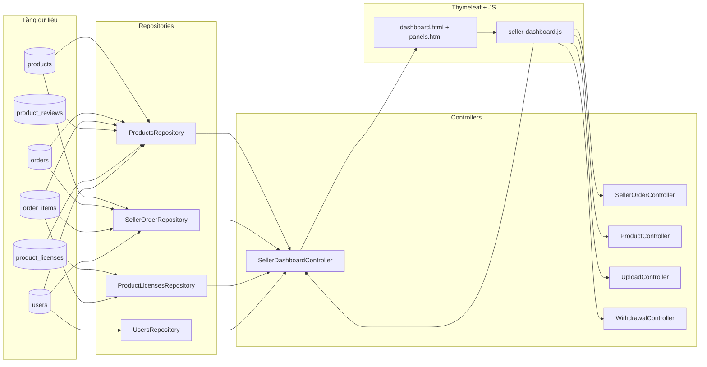
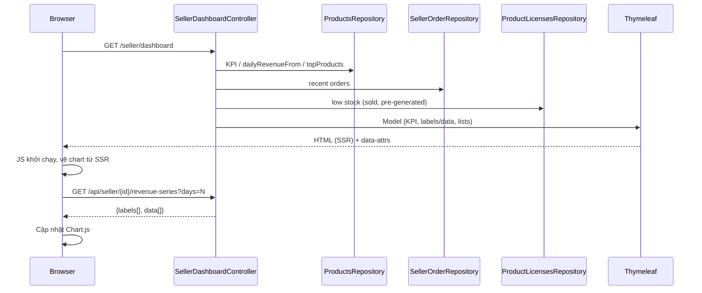
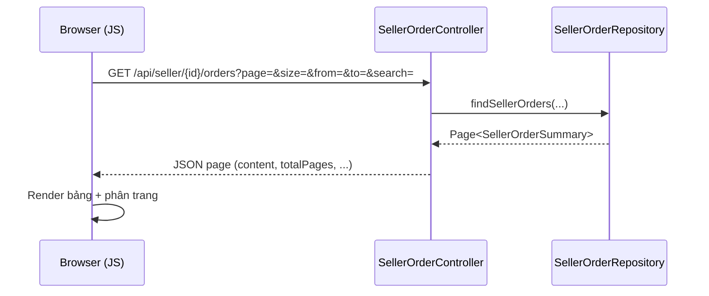

# Seller Dashboard – Luồng dữ liệu từ Database đến UI

Tài liệu này mô tả rõ đường đi của dữ liệu cho trang Seller Dashboard, từ tầng dữ liệu (DB) → Repository → Service/Controller → Template (Thymeleaf) → JavaScript (client) → UI. Mục tiêu giúp bạn nắm được “dữ liệu nào đến từ đâu, được xử lý thế nào và hiển thị ở đâu”.


## Tổng quan
- Trang: `templates/pages/seller/seller_dashboard.html`
- Controller chính: `SellerDashboardController` (HTML + API series)
- Các Repository liên quan:
  - `ProductsRepository`
  - `SellerOrderRepository`
  - `UsersRepository`
  - `ProductLicensesRepository`
- Fragment giao diện được nhúng:
  - `fragments/sidebar.html`
  - `fragments/dashboard.html` (khu vực KPI, chart, low stock, top/recent, ranking)
  - `fragments/panels.html` (các panel phụ: Orders, Licenses, Products, Withdraw, v.v.)
  - `fragments/scripts.html` (nạp `seller-dashboard.js` và script nền)
- Script client: `static/js/seller-dashboard.js` (tăng cường trải nghiệm, gọi API động)


## Xác định danh tính seller (sellerId)
Controller `SellerDashboardController#dashboard` lấy `sellerId` theo thứ tự ưu tiên:
1) Tham số query `?sellerId=` (dùng test/override)
2) Từ `Principal`:
   - Nếu `principal.getName()` là số → parse thành userId
   - Nếu là username → tra `UsersRepository.findByUsername(name)` để lấy `userId`
3) Từ `HttpSession`:
   - `userId` (Long/Integer)
   - hoặc object `user` (kiểu `Users`) → lấy `userId`
4) Fallback demo: `6L`

Giá trị này được gắn vào Model: `sellerId` và đồng thời gán `userId = sellerId` để client dùng thống nhất.


## Tầng dữ liệu (DB) → Repository
Các bảng chính được dùng cho dashboard (suy ra từ SQL/native query):
- `products` (seller_id, price, quantity, status, …)
- `orders` (order_id, user_id, status, created_at, …) – chỉ tính đơn `COMPLETED`
- `order_items` (order_item_id, order_id, product_id, price_at_time, quantity, created_at)
- `product_reviews` (product_id, rating, …)
- `product_licenses` (license_id, order_item_id, license_key, …)
- `users` (user_id, username, …)

Một số truy vấn tiêu biểu trong `ProductsRepository` (native/JPQL):
- Tổng doanh thu: `totalRevenueBySeller(sellerId)` → SUM(oi.price_at_time * oi.quantity)
- Tổng số key bán: `totalUnitsSoldBySeller(sellerId)` → SUM(oi.quantity)
- Tổng số đơn: `totalOrdersBySeller(sellerId)` → COUNT(DISTINCT oi.order_id)
- Điểm đánh giá TB: `averageRatingBySeller(sellerId)` → AVG(pr.rating)
- Doanh thu theo ngày: `dailyRevenueFrom(sellerId, fromDate)` → GROUP BY CAST(oi.created_at AS DATE)
- Top sản phẩm: `topProducts(sellerId)` → doanh thu, units, rating theo product
- Doanh thu hôm nay/tháng này: `todayRevenue`, `thisMonthRevenue`
- Xếp hạng seller: `sellerRevenueRank(sellerId)` + `topSellers()` + `totalSellers()`

`SellerOrderRepository` cung cấp view “đơn hàng của riêng seller” (multi-vendor aware):
- `findSellerOrders(sellerId, from, to, search, pageable)` → Page tóm tắt đơn theo seller
- `findSellerOrder(sellerId, orderId)` → chi tiết tổng hợp (chỉ phần thuộc seller đó)

`ProductLicensesRepository` hỗ trợ đếm số key đã xuất/đã tạo:
- `countByProductViaOrders(productId)` → đếm license gắn với order item của product
- `countPreGeneratedForProduct(productId)` → đếm key “dự phòng” theo prefix `PRD{productId}-…`


## Server-side render (SSR) → Model Attributes → Thymeleaf
`SellerDashboardController#dashboard` chuẩn bị dữ liệu và đặt vào Model. Bên dưới là mapping chính giữa Model và nguồn dữ liệu:

- `sellerId`, `userId`: xác định như phần trên
- KPI & số liệu tổng:
  - `totalRevenue` ← `ProductsRepository.totalRevenueBySeller`
  - `totalUnits` ← `ProductsRepository.totalUnitsSoldBySeller`
  - `totalOrders` ← `ProductsRepository.totalOrdersBySeller`
  - `avgRating` ← `ProductsRepository.averageRatingBySeller`
  - `todayRevenue`, `monthRevenue` ← query tương ứng
- Chuỗi doanh thu theo ngày (mặc định 15 ngày gần nhất, đã fill 0 cho ngày thiếu):
  - `dailyRevenueLabels` (CSV các ngày `yyyy-MM-dd`)
  - `dailyRevenueData` (CSV số)
  - Nguồn: `ProductsRepository.dailyRevenueFrom(sellerId, from)` + logic chuẩn hóa kiểu ngày
- Top sản phẩm:
  - `topProducts` (list map: productId, name, units, revenue, rating) ← `topProducts(sellerId)`
- Đơn gần đây (phạm vi seller):
  - `recentOrders` (list map: orderId, createdAtStr, amount, items) ← `SellerOrderRepository.findSellerOrders(... size=8)`
- Hàng sắp hết (low stock):
  - Duyệt tất cả `products` của seller có trạng thái `public`, tính `remaining = quantity - sold - preGenerated`
  - `sold` ← `ProductLicensesRepository.countByProductViaOrders(productId)`
  - `preGenerated` ← `ProductLicensesRepository.countPreGeneratedForProduct(productId)`
  - Giới hạn 10 sản phẩm còn lại ít nhất; `activeProducts` đếm số `public`
  - Bơm vào `lowStock` (map: productId, name, remaining, status)
- Danh sách “My products” ban đầu (SSR để UI hiển thị ngay):
  - `myProducts` (map cơ bản: id, name, price, quantity, status) ← `findBySellerId`
- Xếp hạng seller:
  - `myRank`, `totalSellers`, `rankPercentile`, `topSellers`
- Thông tin người dùng:
  - `user` ← `UsersRepository.findById(sellerId)`; `userType` nếu có

Thymeleaf bind ở `fragments/dashboard.html`:
- KPI render trực tiếp từ model
- Chart “Revenue by day” đọc `data-labels`, `data-data` từ `<canvas id="revenueChart">`
- Bảng low stock, top products, recent orders, my products hiển thị dữ liệu SSR ngay lập tức (Progressive enhancement sẽ phân trang client-side)

Các fragment khác:
- `fragments/sidebar.html`: hiển thị menu, avatar, tên/email; badge chat sẽ cập nhật bằng JS
- `fragments/panels.html`: chứa các panel Orders, Licenses, Products, Withdraw… (nạp động khi người dùng chuyển tab `#hash`)
- `fragments/scripts.html`: set `window.currentUserType`, đồng hồ `sellerClock`, badge unread chat, và nạp `seller-dashboard.js`


## Client-side enhancement (JS) và API động
File: `static/js/seller-dashboard.js`
- Khởi tạo hiệu ứng đếm số, vẽ biểu đồ Chart.js, phân trang bảng ở client
- Đọc `userId/sellerId` từ DOM (`#userId` ưu tiên)

Các API chính mà dashboard gọi động:

1) Doanh thu theo ngày (tùy chọn khoảng ngày)
   - Endpoint: `GET /api/seller/{sellerId}/revenue-series?days=N`
   - Nguồn: `SellerDashboardController#revenueSeries`
   - Response (JSON): `{ labels: ["yyyy-MM-dd", ...], data: ["<số>", ...] }`
   - UI: cập nhật lại dataset Chart.js và thuộc tính `data-*` của `<canvas>`

2) Danh sách “My products” (refresh, filter trạng thái ở client)
   - Endpoint: `GET /api/products?sellerId={sellerId}`
   - Nguồn: `ProductController#list`
   - Response: mảng `Products`
   - UI: render lại `#tbMyProducts`, đếm `#myProductsCount`, phân trang client

3) Chi tiết đơn hàng (khi người dùng click dòng đơn gần đây hoặc trong panel Orders)
   - Endpoint: `GET /api/seller/{sellerId}/orders/{orderId}`
   - Nguồn: `SellerOrderController#getOne`
   - Response: `{ order: { orderId, createdAt, sellerAmount, sellerItems }, user: { userId, username }, items: [...] }`
   - UI: hiển thị trong modal

4) Panel Orders – danh sách đơn theo seller (khi chuyển tab `#orders`)
   - Endpoint: `GET /api/seller/{sellerId}/orders?page=&size=&from=&to=&search=`
   - Nguồn: `SellerOrderController#list`
   - Response: Page JSON (content + phân trang)

5) Upload ảnh sản phẩm
   - Endpoint: `POST /api/uploads/image` (multipart)
   - Nguồn: `UploadController#uploadImage` (proxy IMGBB, cần API key)

6) CRUD sản phẩm (trong modal sản phẩm)
   - `GET /api/products/{id}` – xem chi tiết
   - `POST /api/products` – tạo mới
   - `PUT /api/products/{id}` – cập nhật (tự đưa về `hidden` nếu thay đổi quan trọng)
   - `DELETE /api/products/{id}` – xóa (chặn xóa nếu đã/đang `public`)
   - `POST /api/products/{id}/approval?publish={true|false}` – duyệt/publish/ẩn (tùy `X-User-Type`)

7) Withdraw (rút tiền) – trong panel `#withdraw`
   - `GET /seller/withdraw/summary` → số dư, tài khoản ngân hàng, lịch sử mới nhất, fee
   - `GET /seller/withdraw/search` → tìm lịch sử rút (filter, phân trang)
   - `POST /seller/withdraw` → tạo lệnh rút
   - `POST /seller/withdraw/bank-account` → thêm tài khoản ngân hàng

8) Sidebar chat badge
   - `GET /api/conversations/{userId}` → tính tổng `unreadCount` để hiển thị badge (được gọi định kỳ 30s)


## Luồng dữ liệu tổng thể (tóm tắt)
```
Trình duyệt ── GET /seller/dashboard ──▶ SellerDashboardController
   │                                               │
   │  Model attributes (KPI, charts, lists, user)  │  Gọi Repository/SQL: products, orders, order_items,
   │◀───────────────────────────────────────────────│  product_reviews, product_licenses, users…
   │
   ├─ Render Thymeleaf: fragments/sidebar, dashboard, panels … → HTML đầu tiên (SSR)
   │
   └─ JS (seller-dashboard.js) khởi chạy:
        • Cập nhật Chart qua /api/seller/{sellerId}/revenue-series
        • Refresh “My products” qua /api/products?sellerId=...
        • Khi chuyển panel (#orders, #keys, #products, #withdraw ...), gọi các API tương ứng
        • Cập nhật badge chat định kỳ /api/conversations/{userId}
```


## Liên kết UI ↔ Dữ liệu (điểm gắn kết chính)
- Chào mừng + tên seller: `fragments/dashboard.html` đọc `${user.fullName | user.username | 'Seller #' + sellerId}`
- KPI: `totalRevenue`, `totalOrders`, `activeProducts`, `avgRating`, `totalUnits` → ô trong grid KPI
- Chart: `<canvas id="revenueChart" data-labels=… data-data=…>` → vẽ bằng Chart.js; JS có thể cập nhật động qua API
- Low stock: bảng `#tbLowStock` → từ `lowStock` (SSR) + phân trang client
- Top products: bảng `#tbTopProducts` → từ `topProducts` (SSR)
- Recent orders: bảng `#tbRecentOrders` → từ `recentOrders` (SSR); click để xem chi tiết qua API
- My products: bảng `#tbMyProducts` (SSR) + `seller-dashboard.js#refreshMyProducts()` để làm mới + filter trạng thái ở client
- Ranking: `myRank`, `rankPercentile`, `topSellers` → 2 thẻ “My ranking” và “Top Sellers”


## Bảo mật & phạm vi dữ liệu
- Tất cả truy vấn doanh thu/đơn hàng đều lọc theo `seller_id` và trạng thái đơn `COMPLETED`
- API chi tiết đơn theo seller chỉ trả về phần thuộc seller đó (`SellerOrderController` lọc `order_items` theo product của seller)
- `sellerId` ưu tiên lấy từ danh tính hiện hành (principal/session); query param chỉ để test


## Hợp đồng API tiêu biểu (contract ngắn)
- GET `/api/seller/{sellerId}/revenue-series?days=15`
  - Input: `sellerId` (path), `days` 1..365 (query)
  - Output: `{ labels: string[], data: string[] }` (số dạng chuỗi để an toàn định dạng)
  - Lỗi: HTTP 4xx/5xx khi sellerId/DB lỗi

- GET `/api/products?sellerId={id}`
  - Output: mảng `Products`

- GET `/api/seller/{sellerId}/orders?page=&size=&from=&to=&search=`
  - Output: `{ content: SellerOrderSummary[], page, size, totalPages, totalElements }`


## Edge cases đã xử lý
- Thiếu ngày trong chuỗi doanh thu: server pre-fill 0 để biểu đồ liền mạch
- Định dạng ngày trả về bởi driver khác nhau (Date/Timestamp/String) → đã chuẩn hóa key `yyyy-MM-dd`
- Tính “low stock” dựa trên số key thực tế (đã bán + đã tạo sẵn) thay vì chỉ cột `quantity` trong bảng `products`
- “My products” trạng thái null/"" được xem như “Pending” để thân thiện UI


## Gợi ý mở rộng/TODO
- Bổ sung cache nhẹ cho KPI/series nếu tải lớn
- Chuẩn hóa xác thực để luôn xác định `sellerId` từ principal, bỏ fallback khi lên production
- API tổng hợp cho dashboard (một call) nếu muốn giảm round-trip khi client khởi chạy
- Thêm unit/integration test cho `SellerDashboardController#revenueSeries` (range lớn, biên `days`)


## Tệp & vị trí liên quan
- View: `src/main/resources/templates/pages/seller/seller_dashboard.html`
- Fragments: `src/main/resources/templates/fragments/*.html`
- Controller:
  - `SellerDashboardController.java`
  - `SellerOrderController.java`
  - `ProductController.java`
  - `WithdrawalController.java`
- Repository:
  - `ProductsRepository.java`
  - `SellerOrderRepository.java`
  - `UsersRepository.java`
  - `ProductLicensesRepository.java`
- Client JS: `src/main/resources/static/js/seller-dashboard.js`


## Bản đồ mã nguồn có chỉ số dòng (source map with line numbers)

Các mốc bên dưới trỏ chính xác tới file và dòng đã kiểm tra trong repo, giúp định vị nhanh logic dữ liệu của Seller Dashboard.

1) Controller render trang và model SSR
- File: `src/main/java/banhangrong/su25/Controller/SellerDashboardController.java`
  - `@GetMapping("/seller/dashboard")` + method `dashboard(...)`: dòng 41–259
    - Xác định `sellerId` từ principal/session: dòng 53–80
    - Tính KPI tổng quan: dòng 81–90
    - Doanh thu hôm nay/tháng này: dòng 91–97
    - Chuỗi doanh thu theo ngày (15 ngày), chuẩn hóa nhãn/ngày: dòng 98–143
      - Gọi repo: `productsRepository.dailyRevenueFrom(...)`: dòng 99
    - Top sản phẩm: dòng 145–156
      - Gọi repo: `productsRepository.topProducts(sellerId)`: dòng 145
    - Đơn gần đây theo seller: dòng 158–175
      - Gọi repo: `sellerOrderRepository.findSellerOrders(...)`: dòng 159
    - Hàng sắp hết + đếm sản phẩm public: dòng 179–201
      - `productLicensesRepository.countByProductViaOrders(...)`: dùng trong vòng lặp
      - `productLicensesRepository.countPreGeneratedForProduct(...)`: dùng trong vòng lặp
      - `productsRepository.countBySellerIdAndStatus(..., "public")`: dòng 201
    - Danh sách "My products" để SSR ban đầu: dòng 204–216 (gán vào model ở dòng 257)
    - Xếp hạng seller (rank, percentile, top sellers): dòng 217–229
      - `productsRepository.sellerRevenueRank(...)`: dòng 217
      - `productsRepository.topSellers()`: dòng 221
    - Gắn dữ liệu vào Model: các `model.addAttribute(...)` chính: dòng 230–248, 257
    - Trả view Thymeleaf: `return "pages/seller/seller_dashboard";` dòng 259

  - API chart động: `@GetMapping("/api/seller/{sellerId}/revenue-series")`: dòng 263–301

2) Repository – nguồn dữ liệu từ DB
- File: `src/main/java/banhangrong/su25/Repository/ProductsRepository.java`
  - Tổng doanh thu seller: `totalRevenueBySeller` – dòng 46
  - Doanh thu theo ngày: `dailyRevenueFrom` – dòng 53
  - Điểm đánh giá TB: `averageRatingBySeller` – dòng 59
  - Top sản phẩm: `topProducts` – dòng 62
  - Đơn gần đây (nếu dùng): `recentOrders` – dòng 65
  - Doanh thu hôm nay: `todayRevenue` – dòng 67
  - Doanh thu tháng này: `thisMonthRevenue` – dòng 70
  - Top sellers: `topSellers` – dòng 74
  - Xếp hạng doanh thu theo seller: `sellerRevenueRank` – dòng 85
  - Tổng số seller: `totalSellers` – dòng 88

- File: `src/main/java/banhangrong/su25/Repository/SellerOrderRepository.java`
  - Trang danh sách đơn của seller: `findSellerOrders(...)` – dòng 68–88
  - Chi tiết một đơn của seller: `findSellerOrder(...)` – dòng 90–111

- File: `src/main/java/banhangrong/su25/Repository/ProductLicensesRepository.java`
  - Đếm license đã phát hành qua order items: `countByProductViaOrders` – dòng 78
  - Đếm license tiền tạo (pre-generated) theo pattern: `countPreGeneratedForProduct` – dòng 82

- File: `src/main/java/banhangrong/su25/Repository/UsersRepository.java`
  - Tìm theo username (xác định seller từ principal): `findByUsername` – dòng 17

3) API phụ trợ mà UI dashboard sử dụng (khi chuyển panel hoặc thao tác)
- File: `src/main/java/banhangrong/su25/Controller/SellerOrderController.java`
  - `@RequestMapping("/api/seller/{sellerId}/orders")` – dòng 25
  - Danh sách đơn (phân trang, lọc): method `list(...)` – khối chứa call repo ở dòng 51
  - Chi tiết đơn: `@GetMapping("/{orderId}")` – dòng 66; trả JSON ghép sản phẩm của seller

- File: `src/main/java/banhangrong/su25/Controller/ProductController.java`
  - `@RequestMapping("/api/products")` – dòng 18
  - `GET /api/products?sellerId=...` → `list(...)` – dòng 32
  - `GET /api/products/seller/{sellerId}/active` – dòng 48
  - `GET /api/products/seller/{sellerId}/active/simple` – dòng 68
  - `PUT /api/products/{id}` – dòng 92; `DELETE /api/products/{id}` – dòng 116
  - `POST /api/products/{id}/approval` – dòng 135

- File: `src/main/java/banhangrong/su25/Controller/UploadController.java`
  - `@RequestMapping("/api/uploads")` – dòng 19
  - `POST /api/uploads/image` (multipart, proxy Imgbb) – dòng 30

- File: `src/main/java/banhangrong/su25/Controller/WithdrawalController.java`
  - `@RequestMapping("/seller/withdraw")` – dòng 24
  - `GET /summary` – dòng 34; `POST /bank-account` – dòng 77; `GET /search` – dòng 99

4) Thymeleaf fragments – nơi dữ liệu hiện ra trên UI
- File: `src/main/resources/templates/fragments/dashboard.html`
  - Canvas biểu đồ doanh thu: `#revenueChart` – dòng 77 (đọc `data-labels`, `data-data`)
  - Bảng low stock: `#tbLowStock` – dòng 95
  - Bộ lọc trạng thái "My products": `#myProductsStatusFilter` – dòng 118
  - Bảng My products: `#tbMyProducts` – dòng 139
  - Bảng Top products: `#tbTopProducts` – dòng 250
  - Bảng Recent orders: `#tbRecentOrders` – dòng 282

- File: `src/main/resources/templates/fragments/scripts.html`
  - Cập nhật đồng hồ: khối có `sellerClock` – khoảng dòng 13–31
  - Badge chat (đếm unread): dùng `meta[name="user-id"]` – dòng 40
  - Nạp JS: `/js/seller-dashboard.js?v=3` – dòng 80

5) JS client – tăng cường và gọi API
- File: `src/main/resources/static/js/seller-dashboard.js`
  - Gọi API chart: `fetch(/api/seller/${sid}/revenue-series?days=...)` – dòng 97
  - Mở chi tiết đơn (seller scope): `fetch(/api/seller/${sid}/orders/${id})` – dòng 882 (và 1853 trong handler khác)
  - Tải “My products”: định nghĩa `refreshMyProducts(...)` – bắt đầu dòng 914; gọi `GET /api/products?sellerId=...` – dòng 919; gọi đầu tiên – dòng 980; bind filter – dòng 986/992
  - Withdraw summary: `GET /seller/withdraw/summary` – dòng 1160


## Luồng dữ liệu chi tiết trong seller-dashboard.js (có số dòng chính xác)

Mục này liệt kê các luồng dữ liệu đầu–cuối trong file `static/js/seller-dashboard.js`: nguồn dữ liệu (SSR/DOM), điểm gọi API (fetch/WebSocket), và nơi đổ dữ liệu ra UI, kèm mốc dòng để tra cứu nhanh.

1) Xác định danh tính seller trên client
- Hàm: `getSellerId()` – dòng 70–82 (mốc: 75, 80)
  - Nguồn: đọc `#userId` (ưu tiên) hoặc `#sellerId` từ DOM
  - Đầu ra: trả về số `sellerId` dùng cho các API khác

2) Biểu đồ doanh thu theo ngày (Chart.js)
- Khởi tạo: `initChart()` – đọc SSR từ `<canvas id="revenueChart" data-labels data-data>`; quyết định không fetch nếu thiếu Chart/canvas
- Cập nhật động: `updateRevenueChart(days)` – dòng 92–116
  - Gọi API: `GET /api/seller/{sid}/revenue-series?days=N` – dòng 97 (check `res.ok` tại 98)
  - Map dữ liệu: cập nhật `revenueChart.data.labels` và `datasets[0].data` – dòng 104–105; `revenueChart.update()`; phản chiếu lại về `data-*` trên `<canvas>` để SSR fallback đồng bộ
- Bộ chọn khoảng ngày: `bindRevenueRange()` – dòng 122–146 (mốc: 125–127, 128–130, 136–140, 144)
  - Nguồn: `#revenueRange` và `#revenueRangeCustom`
  - Hành động: gọi `updateRevenueChart(days)` theo lựa chọn

3) “My Products” – danh sách sản phẩm của tôi
- Hàm: `refreshMyProducts(showToastMsg = true)` – bắt đầu dòng 914
  - Nguồn: xác định `sellerId` giống `getSellerId()`; yêu cầu seller bắt buộc – dòng 918
  - API: `GET /api/products?sellerId={sellerId}` – dòng 919
  - Lọc trạng thái ở client: đọc `#myProductsStatusFilter` → tính `filtered` – dòng 927–943
  - Render UI: ghi vào `#tbMyProducts` – dòng 946, 954–965; cập nhật `#myProductsCount` – dòng 966; gắn click mở modal – dòng 969–973; phân trang client – dòng 975
  - Khởi chạy ban đầu: gọi `refreshMyProducts(false)` – dòng 980
  - Gắn filter động: bind trực tiếp/ủy quyền – dòng 986–987, 988–995

4) Orders – danh sách đơn của seller (panel `#orders`)
- State & DOM: `ordersPageState` và các phần tử `#tbSellerOrders`, `#pgSellerOrders` – dòng 1816–1822
- Tải danh sách: `loadSellerOrders(resetPage = false)` – dòng 1824–1895
  - Thiết lập tham số trang/lọc từ DOM – dòng 1832–1834
  - API: `GET /api/seller/{sellerId}/orders?...` – dòng 1836
  - Render bảng: điền `tbody` – dòng 1841–1873; phân trang client làm khung – dòng 1873; override pager để gọi API khi chuyển trang – dòng 1877–1895
- Bộ lọc/làm mới/xuất CSV – dòng 1900–1908; Enter để tìm – dòng 1905
- Tự động tải khi mở panel `#orders` – sau 120ms – dòng 1912–1914

5) Order detail – chi tiết đơn (modal)
- Loader: `loadOrder(id)` – dòng 879–904
  - API: `GET /api/seller/{sid}/orders/{id}` – mốc 882; một handler khác cũng gọi tại khoảng 1853
  - Render: điền các trường trong modal; chỉ xem (không CRUD)

6) License Keys (panel `#keys`)
- State & DOM: `keysPageState`, `#tbSellerKeys`, `#pgSellerKeys` – dòng 1915–1922
- Tải danh sách: `loadSellerKeys(resetPage=false)` – dòng 1923–1984
  - Thu thập filter: product/active/search – dòng 1927–1929
  - API: `GET /api/seller/{sellerId}/licenses?...` – dòng 1931
  - Render bảng + trống khi rỗng – dòng 1935–1970; phân trang + pager điều hướng – dòng 1973–1984
- Reset/bind tìm kiếm – dòng 1989–1994
- Toggle kích hoạt key bằng click badge – dòng 1998, 2001–2014
- Nạp danh sách sản phẩm để filter – dòng 2018–2022
- Tự động tải khi mở panel – dòng 2024–2025

7) Products panel (danh sách + lọc tại tab `#products`)
- Chuẩn bị danh mục: `populateCategoriesOnce()` – dòng 2034–2042
- Tải danh sách + phân trang server: `loadProductsPanel(resetPage=false)` – dòng 2045–2136
- Gắn handler bộ lọc có fallback bền bỉ – dòng 2140–2176
- Tự động tải khi mở panel – dòng 2177–2178

8) Product CRUD (modal sản phẩm)
- Nạp chi tiết: `loadProduct(id)` – dòng 666–686 (API: `GET /api/products/{id}`)
- Lưu (create/update), Publish/Send for approval, Delete: các handler submit/click trong khoảng 775–862 với các endpoint:
  - `POST /api/products` (tạo mới)
  - `PUT /api/products/{id}` (cập nhật)
  - `DELETE /api/products/{id}` (xóa)
  - `POST /api/products/{id}/approval?publish={true|false}` (duyệt/publish/ẩn)
  - Upload ảnh: `POST /api/uploads/image` (multipart) – khối 733–771

9) Withdraw (rút tiền) – panel `#withdraw`
- Tóm tắt số dư/tài khoản/fee: `loadWithdrawSummary()` – API `GET /seller/withdraw/summary` – dòng 1160–1161
- Tìm lịch sử rút: `searchWithdrawals(params)` – API `GET /seller/withdraw/search` – dòng 1172
- Tạo lệnh rút: `createWithdrawal(payload)` – API `POST /seller/withdraw` – dòng 1177
- Thêm tài khoản ngân hàng: `addBankAccount(payload)` – API `POST /seller/withdraw/bank-account` – dòng 1182
- Render UI + phân trang lịch sử, preview phí/net amount – dòng 1200–1268
- Nạp panel có overlay: `loadWithdrawPanel()` + `withPanelLoading(...)` – dòng 1275–1277; submit form – dòng 1282–1290

10) Check Key (kiểm tra key và lịch sử)
- Khởi tạo IIFE: `initCheckKeyPanel()` – dòng 1292–1299
- API chính: `fetchCheck(key, page, size)` – dòng 1450–1459
- Render chi tiết + lịch sử + phân trang – dòng 1341–1493; xử lý tương tác – dòng 1496–1558

11) Hồ sơ (Profile)
- Modal hồ sơ: bind cancel/close – dòng 1718–1722
- Nạp dữ liệu: `loadProfile(id)` – dòng 1730–1739
- Mở modal: dòng 1741; submit cập nhật – dòng 1744–1770
- Hiển thị ẩn/hiện panel profile tại chỗ (không rời trang): `showProfile/hideProfile` – dòng 1023–1051

12) WebSocket – thông báo đơn hàng realtime
- Kết nối: IIFE `initOrderSocket()` – dòng 1774–1811 (connect logic: 1781–1807)
- URL: `ws(s)://{host}/ws/orders`
- Chỉ bật trên main dashboard (tránh trùng khi ở panel profile) – dòng 1810–1811

13) Điều hướng nội bộ qua sidebar (in-place panels)
- Bản đồ panel: `panelMap` – dòng 1085–1093
- Hiển thị panel theo `hash`: `showPanelByHash(hash)` – dòng 1091–1123 (ẩn dashboard, show panel đích, nạp dữ liệu nếu cần)
- Bind click anchors, lắng nghe `hashchange` – dòng 1127–1132, 1133–1137, 1138–1141

14) Tiện ích khác ảnh hưởng UI dữ liệu
- Phân trang bảng client: `paginateTable(...)` – dòng 168–270 (mốc 177, 186–188, 194, 203, 208–209, 215–227, 231–268)
- Logo fallback: `initLogoFallback()` – dòng 280–309 (mốc 286, 292–309)
- Chuyển theme: `applyTheme(theme)` – dòng 330–357 (mốc 339–340, 349, 357)
- Loader + overlay chung cho panel: `withPanelLoading(panelEl, task, ...)` – dòng 441–483
- Intercept điều hướng để hiệu ứng rời trang mượt: khối 616–631 (mốc 620, 622, 625, 629)

Ghi chú: Một số đoạn được đánh dấu “omitted” trong bản trích dẫn nhưng vẫn có mốc dòng neo (ví dụ 97, 104–105, 114…) để đối chiếu. Các endpoint đều đã được liệt kê cùng vị trí dòng tiêu biểu.


## Trực quan hóa (Mermaid)

### Sơ đồ dòng dữ liệu tổng quan



### Trình tự tải trang và cập nhật biểu đồ



### Trình tự xem danh sách đơn trong panel #orders




## Cách đọc chú giải dòng
- Mỗi mục liệt kê: “dòng X–Y” nghĩa là khối mã chính nằm trong khoảng đó; các lệnh `addAttribute` hoặc `return` quan trọng cũng được nêu dòng chính xác để tra cứu nhanh.
- Các dòng trùng lặp trong grep (hiển thị hai lần) là do công cụ tìm kiếm liệt kê lặp; số dòng vẫn chính xác theo file trong repo.
