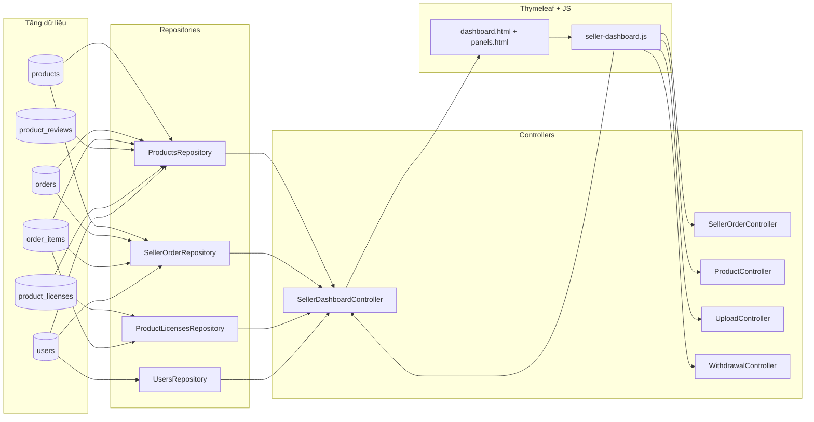
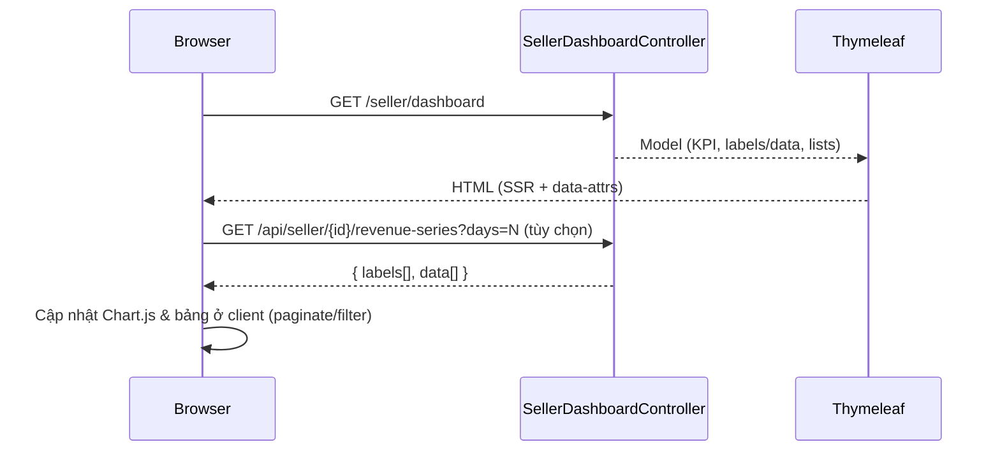
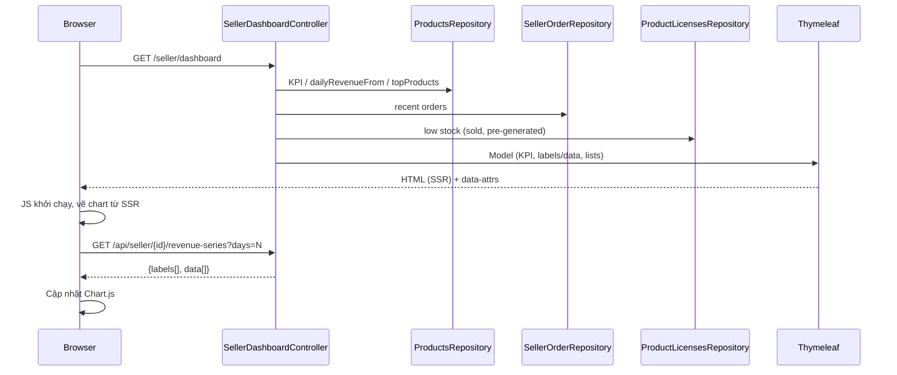
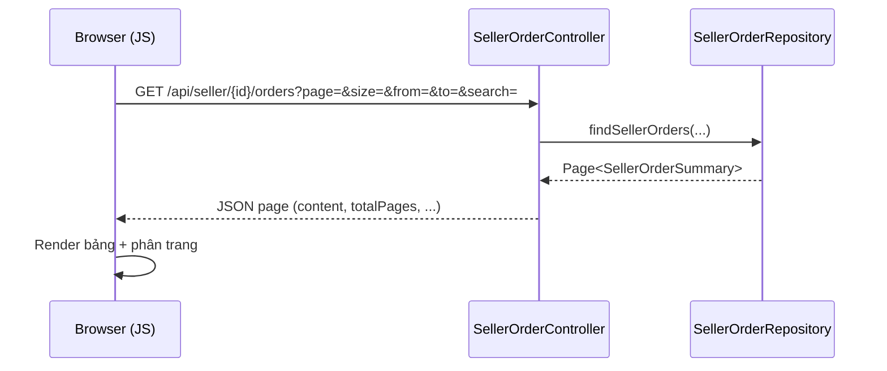

# Seller Dashboard – Luồng dữ liệu (phiên bản đầy đủ)

Tài liệu này mô tả chi tiết đường đi của dữ liệu cho trang Seller Dashboard: DB → Repository → Controller → Thymeleaf (SSR) → JavaScript (client) → UI và chiều ngược lại với các thao tác CRUD. Mục tiêu: cung cấp cái nhìn end‑to‑end rõ ràng, hỗ trợ onboard và tối ưu.

## Trang, code và nơi dữ liệu chảy qua
- View chính: `src/main/resources/templates/pages/seller/seller_dashboard.html`
- Controllers liên quan: `SellerDashboardController`, `SellerOrderController`, `ProductController`, `ProductsApiController`, `WithdrawalController`, `SellerProfileController`, `SellerLicenseController`, `UsersApiController`
- Repositories: `ProductsRepository`, `SellerOrderRepository`, `UsersRepository`, `ProductLicensesRepository`, `WithdrawalRequestRepository`, `ShopLicensesRepository`, `VouchersRepository`
- Fragments UI: `fragments/sidebar.html`, `fragments/dashboard.html`, `fragments/panels.html`, `fragments/modals.html`, `fragments/scripts.html`
- JS client: `static/js/seller-dashboard.js` (pagination, chart, modals, theme, CRUD, toast)

## Sơ đồ luồng dữ liệu (tổng quan)

## Xác định danh tính seller (sellerId)
`SellerDashboardController.dashboard()` xác định `sellerId` theo thứ tự:
1. Query param `sellerId` (debug/test).
2. Principal: lấy username → `UsersRepository.findByUsername()`; nếu là chuỗi số cố parse Long.
3. Session: thuộc tính `user` (Users) hoặc `userId` (Long/Integer).
4. Fallback nếu vẫn null → redirect an toàn (không dùng giá trị cứng trong production).

Gắn `sellerId` + `userId` vào Model để phía client dùng thống nhất (JS ưu tiên `#userId`). Bổ sung kiểm tra `userType` not SELLER/ADMIN → redirect customer dashboard.

## Dữ liệu chính hiển thị và nguồn
- KPI: `totalRevenue`, `totalUnits`, `totalOrders`, `avgRating`, `todayRevenue`, `monthRevenue` ← các native query trong `ProductsRepository`.
- Biểu đồ doanh thu: `dailyRevenueLabels`, `dailyRevenueData` ← build từ `dailyRevenueFrom()` + fill 0 ngày trống.
- Top products: `topProducts` ← `ProductsRepository.topProducts()`.
- Recent orders: `recentOrders` ← Page đầu `SellerOrderRepository.findSellerOrders()` (limit 8).
- Low stock: lọc sản phẩm public `quantity <= 5`; remaining nâng cao tính qua keys (sold + pre-generated) nếu dùng endpoint.
- Active products count: `countBySellerIdAndStatus`.
- My products SSR: `findBySellerId()` (trả bản rút gọn để hiển thị nhanh).
- Ranking: `sellerRevenueRank()` + `totalSellers()` + tính percentile + `topSellers()`.

Trên UI (Thymeleaf, `fragments/dashboard.html`):
- KPI hiển thị trực tiếp từ model
- Chart đọc `data-labels` & `data-data` từ `<canvas id="revenueChart">`
- Các bảng (low stock, top products, recent orders, my products) đều có dữ liệu SSR để hiển thị tức thì; JS chỉ tăng cường (paginate, refresh).

## API động mà JS sử dụng (hợp đồng rút gọn)
1) Doanh thu theo ngày
   - GET `/api/seller/{sellerId}/revenue-series?days=N`
   - Trả về: `{ labels: string[], data: string[] }` (dùng chuỗi để an toàn định dạng số)
   - Dùng để cập nhật Chart.js và phản chiếu lại `data-*` trên `<canvas>`

2) Danh sách “My products”
   - GET `/api/products?sellerId={sellerId}`
   - Trả về: mảng đối tượng `Products`
   - Dùng để render lại bảng `#tbMyProducts`, cập nhật `#myProductsCount`

3) Đơn hàng theo seller (panel Orders)
   - GET `/api/seller/{sellerId}/orders?page=&size=&from=&to=&search=`
   - Trả về: Page JSON `{ content, totalPages, totalElements, ... }`

4) Chi tiết một đơn của seller
   - GET `/api/seller/{sellerId}/orders/{orderId}`
   - Trả về: `{ order, user, items }` (đã lọc chỉ phần thuộc seller)

5) Upload ảnh sản phẩm
   - POST `/api/uploads/image` (multipart) → proxy Imgbb (cần API key)

6) CRUD sản phẩm (trong modal)
   - GET `/api/products/{id}` – xem; POST `/api/products` – tạo; PUT `/api/products/{id}` – cập nhật; DELETE `/api/products/{id}` – xóa (chặn nếu đang `public`)
   - POST `/api/products/{id}/approval?publish={true|false}` – duyệt/publish/ẩn (tùy `X-User-Type`)

7) Withdraw (rút tiền)
   - GET `/seller/withdraw/summary`, GET `/seller/withdraw/search`, POST `/seller/withdraw`, POST `/seller/withdraw/bank-account`

8) Badge chat sidebar
   - GET `/api/conversations/{userId}` → tính tổng `unreadCount` (poll mỗi ~30s)

## Trình tự tải trang (rút gọn)

## Bảo mật & phạm vi dữ liệu
- Dashboard: chặn truy cập nếu userType không SELLER/ADMIN.
- Orders: native query có điều kiện `p.seller_id = :sellerId AND UPPER(o.status)='COMPLETED'` + HAVING đảm bảo chỉ đơn có item của seller.
- Product delete: cấm nếu `was_public=true` hoặc status `public`.
- Publish: bắt buộc header `X-User-Type=ADMIN`.
- Withdraw & Profile: dùng `SecurityUtil.getCurrentUser()` hoặc SecurityContext.
- Upload avatar: kiểm tra MIME + magic bytes + filename sanitize.

## Edge cases đã xử lý
- Daily revenue: pre-fill 0 tránh chart gãy.
- Date normalization đa kiểu (Timestamp, Date, LocalDateTime, String) vào yyyy-MM-dd.
- Low stock: tránh hiển thị sản phẩm không public.
- Product status null/blank normalize thành `pending`; `canceled` -> `cancelled`; `active` -> `public`.
- Giới hạn page size một số API (<=100) tránh tải quá lớn.

## Debug nhanh (gợi ý)
- KPI 0 toàn bộ: kiểm tra userType đúng và có đơn status COMPLETED.
- Chart trống: kiểm tra endpoint `/api/seller/{id}/revenue-series` trả labels hay lỗi 403.
- Product không đổi status sau update: verify logic sensitiveChanged (name/description/downloadUrl).
- Withdraw fail: kiểm tra balance < amount hoặc fee calculation.

## Tệp quan trọng (tham chiếu)
- Controllers: `SellerDashboardController`, `SellerOrderController`, `ProductsApiController`, `ProductController`, `SellerProfileController`, `WithdrawalController`, `SellerLicenseController`, `UsersApiController`.
- Repositories: `ProductsRepository`, `SellerOrderRepository`, `ProductLicensesRepository`, `UsersRepository`, `WithdrawalRequestRepository`, `ShopLicensesRepository`, `VouchersRepository`.
- Views/Fragments: pages/seller + fragments (dashboard / panels / modals / sidebar / scripts).
- JS: `static/js/seller-dashboard.js`.

— Tài liệu này cố ý lược bỏ chỉ số dòng cố định để tránh lỗi thời; ưu tiên tra cứu bằng tên class & phương thức.

## Trực quan hóa (Mermaid)

### Sơ đồ dòng dữ liệu tổng quan

### Trình tự tải trang và cập nhật biểu đồ

### Trình tự xem danh sách đơn trong panel #orders

## Cách đọc chú giải
Tài liệu đã chuyển sang mô tả logic thay vì trích dẫn dòng cụ thể để giảm độ giòn khi code thay đổi. Khi cần kiểm chứng: dùng IDE tìm theo tên phương thức.

## Phụ lục: Quy tắc trạng thái sản phẩm (tóm tắt)
| Current | Thay đổi chỉ price/sale/quantity | Thay đổi name/desc/downloadUrl | Kết quả |
|---------|----------------------------------|--------------------------------|--------|
| public  | giữ public                       | chuyển hidden                  | public/hidden |
| hidden  | bất kỳ                           | bất kỳ                         | hidden |
| pending | bất kỳ                           | bất kỳ                         | hidden |
| khác    | bất kỳ                           | bất kỳ                         | hidden |

## Phụ lục: Đề xuất cải tiến
- Thêm cache ngắn hạn (Caffeine) cho KPI / topProducts.
- Chuẩn hoá error response `{code, message}`.
- Hợp nhất `ProductsApiController` & `ProductController` tránh lặp logic status.
- Thêm test đơn vị cho quy tắc chuyển trạng thái sản phẩm.
- Unique composite index (seller_id + lower(name)).

## Phụ lục: Vị trí mã (file & dòng)
> Các số dòng lấy từ nhánh hiện tại thời điểm 2025-11-10. Có thể thay đổi khi refactor; dùng để tra cứu nhanh.

### SellerDashboardController
| Chức năng | Dòng bắt đầu annotation / phương thức |
|-----------|----------------------------------------|
| `@GetMapping("/seller/dashboard")` | `SellerDashboardController.java:40` |
| `@GetMapping("/api/seller/{sellerId}/revenue-series")` | `SellerDashboardController.java:317-318` |

### ProductsRepository (các KPI chính)
| Phương thức | Dòng |
|-------------|------|
| `findBySellerId` | 36 |
| `countBySellerIdAndStatus` | 46 |
| `totalRevenueBySeller` | 49 |
| `totalUnitsSoldBySeller` | 52 |
| `dailyRevenueFrom` | 55 |
| `totalOrdersBySeller` | 58 |
| `averageRatingBySeller` | 61 |
| `topProducts` | 64 |
| `todayRevenue` | 70 |
| `thisMonthRevenue` | 73 |
| `topSellers` | 76 |
| `sellerRevenueRank` | 88 |
| `totalSellers` | 91 |

### SellerOrderController & SellerOrderRepository
| Chức năng | Dòng |
|-----------|------|
| `@RequestMapping("/api/seller/{sellerId}/orders")` | 25 |
| Gọi `findSellerOrders` (trong list) | 51 |
| `@GetMapping("/{orderId}")` | 66 |
| Gọi `findSellerOrder` | 68 |
| Repo `findSellerOrders` | `SellerOrderRepository.java:68` |
| Repo `findSellerOrder` | `SellerOrderRepository.java:90` |

### ProductsApiController
| Annotation / endpoint | Dòng |
|-----------------------|------|
| `@RequestMapping("/api/products-lite")` | 19 |
| `@GetMapping("/{id}/remaining")` | 52 |
| `@GetMapping("/{id}/vouchers")` | 74 |
| `@GetMapping("/validate-name")` | 325 |
| `@PostMapping("/{id}/approval")` | 358 |
| `@PostMapping("/{id}/pending")` | 377 |

### ProductController
| Endpoint | Dòng |
|----------|------|
| `@RequestMapping("/api/products")` | 20 |
| `@GetMapping("/{id}")` | 52 |
| `@GetMapping("/seller/{sellerId}/active")` | 61 |
| `@GetMapping("/seller/{sellerId}/active/simple")` | 81 |
| `@PutMapping("/{id}")` | 125 |
| `@DeleteMapping("/{id}")` | 206 |
| `@PostMapping("/{id}/approval")` | 235 |
| `@GetMapping("/status/{status}")` | 266 |

### UsersApiController
| Endpoint | Dòng |
|----------|------|
| `@GetMapping("/api/users/search")` | 24 |

### WithdrawalController
| Endpoint | Dòng |
|----------|------|
| `@RequestMapping("/seller/withdraw")` | 24 |
| `@GetMapping("/summary")` | 34 |
| `@PostMapping("/bank-account")` | 77 |
| `@GetMapping("/search")` | 99 |

### SellerProfileController
| Endpoint | Dòng |
|----------|------|
| `@RequestMapping("/seller")` | 30 |
| `@GetMapping("/profile")` | 67 |
| `@PostMapping("/profile/update")` | 96 |
| `@PostMapping("/profile/upload-avatar")` | 225 |

### ProductLicensesRepository
| Thành phần | Dòng |
|------------|------|
| `interface LicenseView` | 17 |
| `findSellerLicenses` | 70 |
| `findByOrderId` | 115 |

### JS seller-dashboard.js (gọi revenue dynamic)
| Mô tả | Dòng |
|-------|------|
| fetch revenue series (`updateRevenueChart`) | 97 |

> Ghi chú: Nếu chỉnh sửa đáng kể file, cập nhật lại bảng này để tránh nhầm lẫn.
