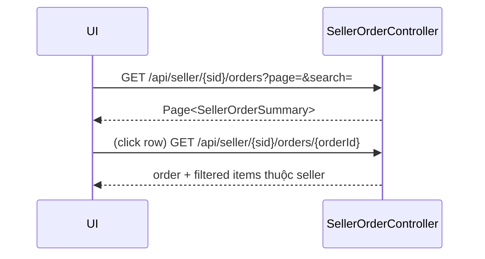

# Seller Dashboard – Tài liệu chi tiết các Panel (#orders, #keys, #check-key, #products, #gen-keys, #withdraw)

Tài liệu này mô tả cấu trúc, luồng dữ liệu, API và edge cases cho từng "panel" (phần) trên trang `/seller/dashboard` được kích hoạt bằng URL hash. Phong cách phù hợp với `seller-dashboard-data-flow.md`, bổ sung chiều sâu cho từng phân hệ.

## 0. Tổng quan cơ chế panel
- Trang nền: `pages/seller/seller_dashboard.html` + fragment `fragments/dashboard.html` + `fragments/panels.html`.
- JavaScript điều hướng nội bộ: hàm `showPanelByHash(hash)` trong `static/js/seller-dashboard.js`.
- Bản chất mỗi panel là một `<section>` có `id="...Panel"` và thuộc tính `data-panel="..."`.
- Điều hướng: thay đổi hash (`#orders`, `#keys`, ...) → ẩn dashboard chính (`#dashboardContent`) → hiển thị section tương ứng.
- Tải dữ liệu động chỉ khi panel được hiển thị (lazy load) để tối ưu initial LCP:
  - `#orders` → `loadSellerOrders()`
  - `#keys` → `loadSellerKeys()`
  - `#products` → `loadProductsPanel()`
  - `#gen-keys` → `initGenerateKeys()` (khởi tạo bảng nội bộ + gọi danh sách sản phẩm PUBLIC)
  - `#withdraw` → `loadWithdrawPanel()`
  - `#check-key` không preload – chờ người dùng nhập key.

### Bảo mật chung
- Việc xác thực seller diễn ra ở `SellerDashboardController#dashboard` (chặn non-SELLER). Các API riêng có kiểm tra quyền bằng sellerId và mối quan hệ entity.
- Khi dùng API `/api/seller/{sellerId}/...`, frontend lấy sellerId từ model `sellerId`/`userId` (SSR).
- Một số API có kiểm tra chéo product ownership (vd: generate licenses, toggle license, license check với sellerId).

---
## 1. Panel Orders – `#orders`
**Mục đích:** Hiển thị danh sách đơn hàng liên quan đến seller hiện tại (chỉ phần seller). Cho phép lọc theo thời gian, search, export CSV, xem chi tiết.

**UI Elements chính:**
| ID | Vai trò |
|----|---------|
| `ordersPanel` | Container panel |
| `ord_search` | Ô search (orderId / username) |
| `ord_from`, `ord_to` | Lọc theo khoảng thời gian (ISO local datetime) |
| `tbSellerOrders` | `<tbody>` dữ liệu đơn |
| `pgSellerOrders` | Pager động |
| `ord_btnExport` | Xuất CSV |
| Modal `orderModal` | Xem chi tiết đơn |

**API chính:**
1. `GET /api/seller/{sellerId}/orders`  
   Query params: `page`, `size` (≤100), `from`, `to` (`LocalDateTime`), `search`.  
   Response (rút gọn):
   ```json
   {
     "content": [
       {"orderId":123,"createdAt":"2025-09-28T14:22:10","buyerUsername":"alice","sellerItems":2,"sellerAmount":45000.0}, ...
     ],
     "page":0,"size":10,"totalPages":N,"totalElements":M
   }
   ```
2. `GET /api/seller/{sellerId}/orders/{orderId}`  
   Trả về `{ order:{...}, user:{...}, items:[{productId,productName,quantity,priceAtTime}] }`.

**Luồng tóm tắt:**


**Edge Cases:**
- Size >100 bị ép về 100 (hard cap).  
- Đơn không thuộc seller → `findSellerOrder` trả null → 404.  
- Xuất CSV chỉ lấy cột hiển thị, không tự động tải thêm trang.

---
## 2. Panel Licenses – `#keys`
**Mục đích:** Quản lý license keys đã bán hoặc pre-generated gắn với sản phẩm của seller. Hỗ trợ filter, paging và toggle trạng thái active.

**UI Elements:** `keysPanel`, `key_product`, `key_active`, `key_search`, `tbSellerKeys`, `pgSellerKeys`.

**API:**
1. `GET /api/seller/{sellerId}/licenses`  
   Params: `page`, `size`, `active`, `productId`, `search` (string chứa trong key).  
   Response (rút gọn):
   ```json
   {
     "content": [
       {"licenseId":1,"licenseKey":"PRD15-20251001-ABCDEF...","productName":"Tool X","orderId":9001,
        "isActive":true,"activationDate":"2025-10-02T09:11:00","deviceIdentifier":"<encoded>|host=..."}, ...
     ],
     "page":0,"totalPages":5
   }
   ```
2. `PATCH /api/seller/{sellerId}/licenses/{licenseId}`  
   Body cho toggle: `{ "isActive": false }` hoặc cập nhật `deviceIdentifier`.

**Logic bảo mật:** Kiểm tra license → order item → product → sellerId trùng khớp.

**Edge Cases:**
- Nếu license không gắn `orderItemId` hoặc product không thuộc seller → 403.  
- Toggle chỉ thay đổi `isActive` + ghi log usage (`activated`/`deactivated`).  
- Fallback expire date được suy ra từ pattern key `PRD<productId>-yyyyMMdd-rand` (frontend tự xử lý hiển thị).

---
## 3. Panel Check Key – `#check-key`
**Mục đích:** Tra cứu nhanh tình trạng một license key (active? thiết bị? lịch sử sử dụng?). Không điều hướng khỏi dashboard.

**UI Elements:** `checkKeyPanel`, `ck_key`, `ck_btnCheck`, `ck_history`, `ck_history_pager`, `ck_details`, `ck_device_*`.

**API:**
`GET /api/licenses/check?key=...&page=&size=&sellerId=`  
- Nếu gửi kèm `sellerId`, backend xác thực quyền xem license dựa trên chuỗi quan hệ.  
- Response chứa thông tin license + mảng `history` (paged) từ `license_usage_logs`.

**Response ví dụ:**
```json
{
  "licenseId": 55,
  "licenseKey": "PRD22-20251130-1F2E3D4C5B6A",
  "isActive": true,
  "activationDate": "2025-11-04T10:02:11",
  "lastUsedDate": "2025-11-05T09:00:54",
  "deviceIdentifier": "DVC882233|host=ws1;plat=WIN;cpu=i7;cores=8;mem=16384|C:/apps/X",
  "orderItemId": 9901,
  "productId": 22,
  "productName": "Mega Suite",
  "history": [
    {"time":"2025-11-05T09:00:54","action":"used","ip":"1.2.3.4","device":"DVC882233"}
  ],
  "page":0,"totalPages":1
}
```

**Edge Cases & Parsing:**
- Nếu license không tồn tại → 404.  
- Nếu `sellerId` cung cấp nhưng không khớp sản phẩm → 403.  
- Frontend tự rút gọn đường dẫn thiết bị dài (giữa cắt `...`).  
- Expire date được suy ra từ phần giữa của key nếu backend không cung cấp.

---
## 4. Panel Products – `#products`
**Mục đích:** Danh sách sản phẩm của seller với filter mở rộng (tên, category, rating tối thiểu, sales tối thiểu, trạng thái). Cho phép mở modal CRUD.

**UI Elements:** `productsPanel`, `prd_search`, `prd_category`, `prd_rating`, `prd_downloads`, `prd_status`, `prd_btnFilter`, `prd_btnReset`, `prdGrid`.

**API liên quan:**
- `GET /api/products/search?...` (tùy biến – code hiển thị gọi endpoint search; nếu chưa có repo method tương ứng cần đảm bảo tồn tại).  
- `GET /api/products?sellerId=` – refresh danh sách riêng seller.
- CRUD sản phẩm:
  - `POST /api/products` – tạo (yêu cầu: `sellerId`, `name`, `price`, `quantity > 0`, `downloadUrl`). Status mặc định `pending`.
  - `PUT /api/products/{id}` – cập nhật có logic auto chuyển `public → hidden` nếu thay đổi nhạy cảm (name/description/downloadUrl).
  - `DELETE /api/products/{id}` – chỉ khi chưa từng `public` (`wasPublic` false & `status != public`).
  - `POST /api/products/{id}/approval?publish=` (header `X-User-Type`). Seller gửi duyệt → `pending`; Admin publish → `public` và set `wasPublic=true`.

**Modal form validation (frontend):**
- Giá & salePrice ≥ 0; salePrice ≤ price.  
- Quantity integer > 0.  
- Download URL bắt buộc & hợp lệ (http/https).  
- Tên không trùng (case-insensitive) trong cùng seller (check sơ bộ client + endpoint validate-name phụ).

**Edge Cases:**
- Đổi nhạy cảm trên sản phẩm PUBLIC → chuyển sang `hidden` để chờ quy trình kiểm duyệt lại.  
- Xóa sản phẩm từng PUBLIC → 409 `cannot_delete_public_product`.  
- Trạng thái null/legacy → chuẩn hóa thành `pending` (helper `ensureStandardStatus`).

---
## 5. Panel Generate Keys – `#gen-keys`
**Mục đích:** Sinh trước license key cho sản phẩm PUBLIC; optional gắn vào user (tạo order tự động) hoặc vào một order item có sẵn.

**UI Elements:** `generateKeysPanel`, `gk_product_table`, `gk_product_q`, `gk_user_table`, `gk_qty`, `gk_expire`, `gk_order_item`, `gk_submit`.

**API:**
`POST /api/seller/{sellerId}/licenses/generate`  
Body ví dụ:
```json
{
  "productId": 22,
  "quantity": 10,
  "expireDate": "2025-12-31",  // hoặc yyyyMMdd
  "userId": 88,                 // optional (nếu không có orderItemId)
  "orderItemId": 1234           // optional
}
```
**Quy tắc:**
- Sản phẩm phải thuộc seller và `status=public`.  
- Tổng (sold + preGenerated + requestQty) ≤ `product.quantity` ban đầu. Nếu vượt → cắt `requestQty` về `remaining`.  
- Nếu không có `orderItemId` nhưng có `userId` → AUTO tạo `Orders` + `OrderItems` tạm (status completed, amount = 0) để quản lý.  
- Format key: `PRD<productId>-yyyyMMdd-<12 hex upper>`; `expireDate` tự sinh +30 ngày nếu bỏ trống.  
- Sau khi tạo: giảm `product.quantity` tương ứng (phản ánh capacity đã dùng).

**Response:** `{ generated: <int>, remaining: <int> }`.

**Edge Cases:**
- `quantity <= 0` → 400.  
- Product không PUBLIC → 400.  
- Hết capacity (`remaining <= 0`) → 400 `no capacity left`.  
- Thiếu `userId` khi cần auto tạo order → 400.  
- `expireDate` sai định dạng → 400 `invalid expireDate`.

---
## 6. Panel Withdraw – `#withdraw`
**Mục đích:** Quản lý rút tiền: xem số dư, thêm tài khoản ngân hàng, tạo yêu cầu, tra cứu lịch sử.

**UI Elements:** `withdrawPanel`, `wd_bank`, `wd_amount`, `wd_all`, `wd_add_bank`, `wd_history`, `wd_pager`, filter form `wd_filters`.

**API:**
1. `GET /seller/withdraw/summary`  
   Trả về: `balance`, `accounts[]`, `history[] (gần đây)`, `feePercent`.
2. `POST /seller/withdraw`  
   Body: `{"bankAccountId": <id>, "amount": 100000.00, "withdrawAll": false}` → tạo `WithdrawalRequest` lấy fee = 2%.
3. `POST /seller/withdraw/bank-account`  
   Body: `{ bankName, bankCode, accountNumber, accountHolderName, branch, makeDefault }`.
4. `GET /seller/withdraw/search`  
   Params: `status`, `fromDate`, `toDate`, `minAmount`, `maxAmount`, `page`, `size` → Page<WithdrawalRequest>.

**Edge Cases:**
- Chưa đăng nhập → 401 từ tất cả endpoint.  
- Rút toàn bộ (`withdrawAll=true`) → server tự dùng `balance` hiện tại.  
- Tài khoản ngân hàng trống → hiển thị note “No bank accounts yet…”.  
- Fee tính đơn giản: `amount * (feePercent/100)`; UI hiển thị Net preview realtime.

---
## 7. Bảng tóm tắt API theo panel
| Panel | Endpoint chính | Kiểu | Mô tả nhanh |
|-------|----------------|------|-------------|
| Orders | `/api/seller/{sid}/orders`, `/api/seller/{sid}/orders/{orderId}` | GET | Paging & chi tiết đơn seller |
| Licenses | `/api/seller/{sid}/licenses`, `/api/seller/{sid}/licenses/{id}` | GET / PATCH | Danh sách & toggle key |
| Check Key | `/api/licenses/check` | GET | Tra cứu trạng thái & lịch sử license |
| Products | `/api/products`, `/api/products/{id}`, `/api/products/{id}/approval` | CRUD | Quản lý sản phẩm seller |
| Generate Keys | `/api/seller/{sid}/licenses/generate` | POST | Sinh batch license (capacity aware) |
| Withdraw | `/seller/withdraw/*` | GET / POST | Quản lý rút tiền & lịch sử |

---
## 8. Các tình huống đặc biệt (Cross-panel)
- **Hash điều hướng trở về mặc định**: hash không khớp panel → khôi phục dashboard (ẩn tất cả panel).  
- **SSR Fallback**: Nếu JS không load được, chỉ phần dashboard gốc có dữ liệu; các panel phụ rỗng (vì không SSR).  
- **Pagination nâng cao**: Mỗi panel có logic pager riêng (API page vs client slice). Orders/Keys/Products dùng API paging; bảng SSR (Top Products, Recent Orders) dùng client paginate với filler rows ổn định chiều cao.  
- **Format ngày**: Controller chuẩn hóa daily revenue; các panel khác dùng raw `LocalDateTime` hoặc format trong JS.

---
## 9. Gợi ý kiểm thử nhanh
| Mục tiêu | Thao tác | Kết quả mong đợi |
|----------|---------|------------------|
| Toggle license | PATCH isActive false → true | Badge đổi ON/OFF + toast success |
| Generate vượt capacity | Gửi quantity lớn hơn remaining | Response `generated` cắt xuống, không lỗi |
| Xóa sản phẩm từng PUBLIC | DELETE product wasPublic=true | 409 với message rõ ràng |
| Check key khác seller | Thêm `sellerId` sai | 403 “Không có quyền xem license này” |
| Withdraw all | `withdrawAll=true` | `amount` trong backend = balance hiện tại |

---
## 10. Next Steps / TODO đề xuất
- Thêm endpoint hợp nhất cho thống kê nhanh keys (active vs inactive count).  
- Bổ sung WebSocket realtime cho panel Orders thay vì poll manual khi hash đổi.  
- Cache tạm danh sách sản phẩm PUBLIC cho panel Gen Keys để giảm số lần fetch.  
- Bổ sung bulk action (activate/deactivate nhiều license).  
- Thêm phân quyền chi tiết cho ADMIN xem dashboard seller mà không dùng sellerId giả.

---
**Tham chiếu mã nguồn chính:**
- Controllers: `SellerDashboardController`, `SellerOrderController`, `ProductController`, `ProductLicenseController`, `WithdrawalController`.
- View fragments: `fragments/panels.html` (định nghĩa markup panel), `fragments/dashboard.html`.
- Client JS: `static/js/seller-dashboard.js` (hàm: `showPanelByHash`, `loadSellerOrders`, `loadSellerKeys`, `loadProductsPanel`, `loadWithdrawPanel`).

> Tài liệu này đồng bộ ngày tạo: 2025-11-10. Khi refactor tên biến/hàm, cập nhật lại phần mô tả tương ứng.
